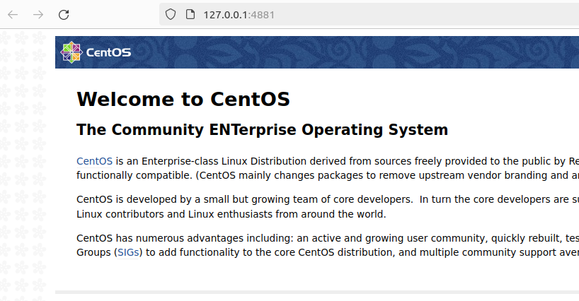
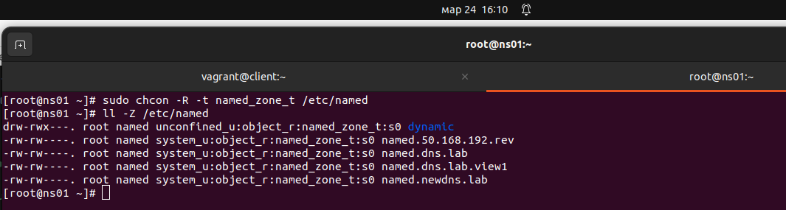
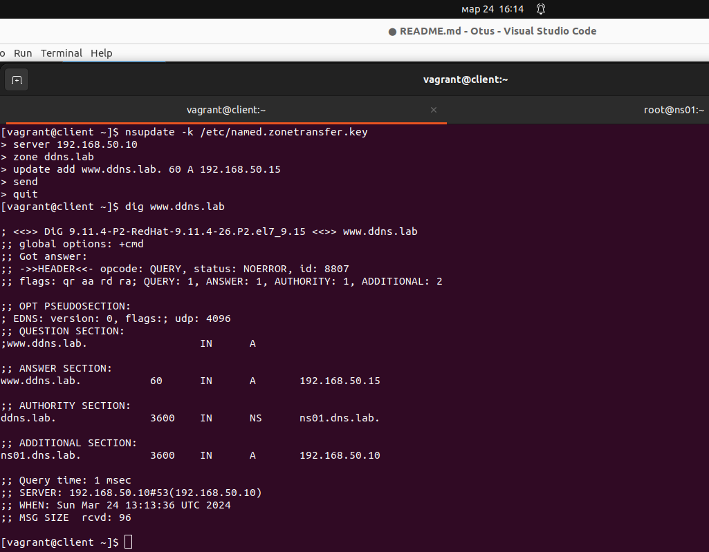

# Занятие 18. SELinux

## Цель домашнего задания:
Диагностировать проблемы и модифицировать политики SELinux для корректной работы приложений.

## 1 - Запустить nginx на нестандартном порту 3-мя разными способами:

### 1a - переключатели setsebool

vagrant up  
vagrant ssh  
sudo -i  
yum install setroubleshoot  

grep nginx /var/log/audit/audit.log | audit2why
```
type=AVC msg=audit(1710692370.840:897): avc:  denied  { name_bind } for  pid=3022 comm="nginx" src=4881 scontext=system_u:system_r:httpd_t:s0 tcontext=system_u:object_r:unreserved_port_t:s0 tclass=tcp_socket permissive=0

	Was caused by:
	The boolean nis_enabled was set incorrectly. 
	Description:
	Allow nis to enabled

	Allow access by executing:
	# setsebool -P nis_enabled 1
```

setsebool -P nis_enabled on  

systemctl restart nginx  
systemctl status nginx  
```
● nginx.service - The nginx HTTP and reverse proxy server
   Loaded: loaded (/usr/lib/systemd/system/nginx.service; disabled; vendor preset: disabled)
   Active: active (running) since Sun 2024-03-21 18:06:15 UTC; 16s ago
  Process: 22475 ExecStart=/usr/sbin/nginx (code=exited, status=0/SUCCESS)
  Process: 22472 ExecStartPre=/usr/sbin/nginx -t (code=exited, status=0/SUCCESS)
  Process: 22471 ExecStartPre=/usr/bin/rm -f /run/nginx.pid (code=exited, status=0/SUCCESS)
 Main PID: 22477 (nginx)
   CGroup: /system.slice/nginx.service
           ├─22477 nginx: master process /usr/sbin/nginx
           └─22479 nginx: worker process

Mar 17 18:06:15 selinux systemd[1]: Starting The nginx HTTP and reverse proxy server...
Mar 17 18:06:15 selinux nginx[22472]: nginx: the configuration file /etc/nginx/nginx.conf syntax is ok
Mar 17 18:06:15 selinux nginx[22472]: nginx: configuration file /etc/nginx/nginx.conf test is successful
Mar 17 18:06:15 selinux systemd[1]: Started The nginx HTTP and reverse proxy server.
```


Отключаем nis_enabled:  
setsebool -P nis_enabled off  
systemctl restart nginx  
Job for nginx.service failed because the control process exited with error code. See "systemctl status nginx.service" and "journalctl -xe" for details.  

### 1b - добавление нестандартного порта в имеющийся тип

semanage port -a -t http_port_t -p tcp 4881  
semanage port -l | grep  http_port_t  
```
http_port_t                    tcp      4881, 80, 81, 443, 488, 8008, 8009, 8443, 9000
pegasus_http_port_t            tcp      5988
```

systemctl start nginx  
curl http://localhost:4881  
```
<!DOCTYPE HTML PUBLIC "-//W3C//DTD HTML 4.01 Transitional//EN">
<html>
<head>
  <title>Welcome to CentOS</title>
...
```

Удаляем порт и убеждаемся, что nginx опять не запускается:  
semanage port -d -t http_port_t -p tcp 4881  
systemctl restart nginx  
Job for nginx.service failed because the control process exited with error code. See "systemctl status nginx.service" and "journalctl -xe" for details.  

### 1c - формирование и установка модуля SELinux

grep nginx /var/log/audit/audit.log | audit2allow -M nginx  
semodule -i nginx.pp  
systemctl start nginx  
systemctl status nginx
```
● nginx.service - The nginx HTTP and reverse proxy server
   Loaded: loaded (/usr/lib/systemd/system/nginx.service; disabled; vendor preset: disabled)
   Active: active (running)
```

semodule -r nginx  
libsemanage.semanage_direct_remove_key: Removing last nginx module (no other nginx module exists at another priority).  
semodule -l|grep nginx  

## Обеспечить работоспособность приложения при включенном selinux

cd selinux_dns_problems/  
vagrant up  

vagrant ssh client  
sudo apt install policycoreutils-python-utils  
nsupdate -k /etc/named.zonetransfer.key  
> server 192.168.50.10  
> zone ddns.lab     
> update add www.ddns.lab. 60 A 192.168.50.15  
> send  
update failed: SERVFAIL  

Проверяем, ошибок на клиенте нет:  
sudo cat /var/log/audit/audit.log | audit2why 

vagrant ssh ns01  
sudo -i  
cat /var/log/audit/audit.log | audit2why  
```
type=AVC msg=audit(1711284079.798:2017): avc:  denied  { create } for  pid=5376 comm="isc-worker0000" name="named.ddns.lab.view1.jnl" scontext=system_u:system_r:named_t:s0 tcontext=system_u:object_r:etc_t:s0 tclass=file permissive=0

	Was caused by:
		Missing type enforcement (TE) allow rule.

		You can use audit2allow to generate a loadable module to allow this access.
```

sudo semanage fcontext -l | grep named  
```
/etc/rndc.*                                        regular file       system_u:object_r:named_conf_t:s0 
/var/named(/.*)?                                   all files          system_u:object_r:named_zone_t:s0 
/etc/unbound(/.*)?                                 all files          system_u:object_r:named_conf_t:s0 
/var/run/bind(/.*)?                                all files          system_u:object_r:named_var_run_t:s0 
...
```

Изменим тип контекста безопасности для каталога /etc/named:  
sudo chcon -R -t named_zone_t /etc/named  


Пробуем применить настройки с клиента еще раз:  
