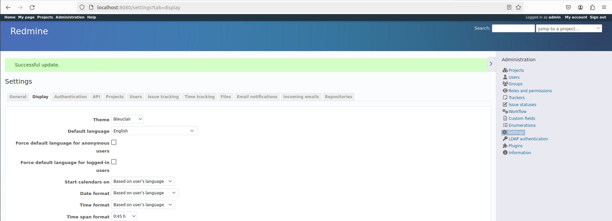

# Занятие 19. Docker

## Цель домашнего задания:
Разобраться с основами docker, с образом, эко системой docker в целом.

## Описание домашнего задания:
Создайте свой кастомный образ nginx на базе alpine. После запуска nginx должен отдавать кастомную страницу (достаточно изменить дефолтную страницу nginx)  

Создаем [Dockerfile](./Dockerfile), беря за основу image nginx:alpine и подменяя при помощи COPY дефолтную [html](./index.html) страницу:  
FROM nginx:alpine  
COPY ./index.html /usr/share/nginx/html/index.html  

Собираем image на его основе:  
sudo docker build -t nginx:otus .  

Отвечая на вопрос "Определите разницу между контейнером и образом", видим, что image (фактически шаблон контейнера) уже создался:
```
docker images
REPOSITORY   TAG       IMAGE ID       CREATED         SIZE
nginx        otus      28a72937e7c0   5 minutes ago   42.6MB
```
Но как таковой контейнер (экземпляр, создаваемый на основе image) еще не создан:
```
docker ps -a
CONTAINER ID   IMAGE     COMMAND   CREATED   STATUS    PORTS     NAMES
```

Используем docker run для создания и запуска контейнера:  
```
docker run -d -p 8080:80 --name nginx nginx:otus
21f422f5ba4f2e9420b7f4a5233a5024df1c6ebd86fc9f7318fae309c9967bd6

docker ps -a
CONTAINER ID   IMAGE        COMMAND                  CREATED         STATUS         PORTS                                   NAMES
21f422f5ba4f   nginx:otus   "/docker-entrypoint.…"   2 minutes ago   Up 2 minutes   0.0.0.0:8080->80/tcp, :::8080->80/tcp   nginx
```

Проверяем:  
```
curl http://localhost:8080
<html>
<head>
  <title>Docker Nginx</title>
</head>
<body>
  <h2>Hello Otus!</h2>
</body>
```

Загружаем image в Docker Hub:
```
docker login
docker tag nginx:otus ivanego/nginx:otus
docker images
REPOSITORY      TAG       IMAGE ID       CREATED          SIZE
ivanego/nginx   otus      28a72937e7c0   14 minutes ago   42.6MB
nginx           otus      28a72937e7c0   14 minutes ago   42.6MB

docker push ivanego/nginx:otus
The push refers to repository [docker.io/ivanego/nginx]
a210c3bada6d: Pushed 
```

https://hub.docker.com/repository/docker/ivanego/nginx/general

__Можно ли в контейнере собрать ядро?__
Насколько я понимаю, собрать ядро в контейнере можно, но запуститься с него не получится, т.к. в этом ключевое отличие контейнера от виртуальной машины - контейнер использует ядро хоста.

## Написать Docker-compose для приложения Redmine, с использованием опции build.

За основу взял docker-compose файл с docker hub: https://hub.docker.com/_/redmine/  

В [него](./Redmine/docker-compose.yml) прописал именованный volume, в который скопировал тему, взятую с https://github.com/farend/redmine_theme_farend_bleuclair  

sudo cp -r themes/* /var/lib/docker/volumes/redmine_themes/_data  

