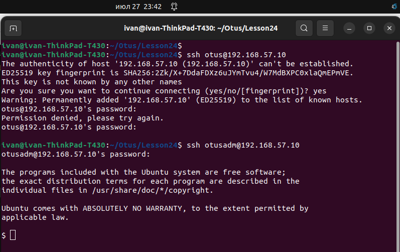

# Занятие 24. Пользователи и группы. Авторизация и аутентификация

## Цель домашнего задания:
Научиться создавать пользователей и добавлять им ограничения.

## Описание домашнего задания:

Задание было выполнено согласно шагам из методички:  
https://docs.google.com/document/d/1lOFe3rv0QcnvOTNfQm0OMHbNQ0Cet6AR/edit

При помощи Ansbile:  
- Создаем группу admin
- Создаем пользователей otusadm и otus (hash пароля сформирован при помощи openssl passwd -6 -stdin)
- Копируем скрипт в /usr/local/bin/login.sh
- Копируем файл настроек PAM для sshd, включающий вызов скрипта из pam_exec

### Проверяем
Сегодня суббота, otusadm может подключиться по ssh, а otus нет:  
