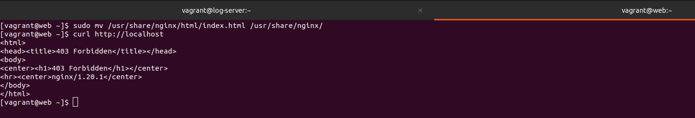
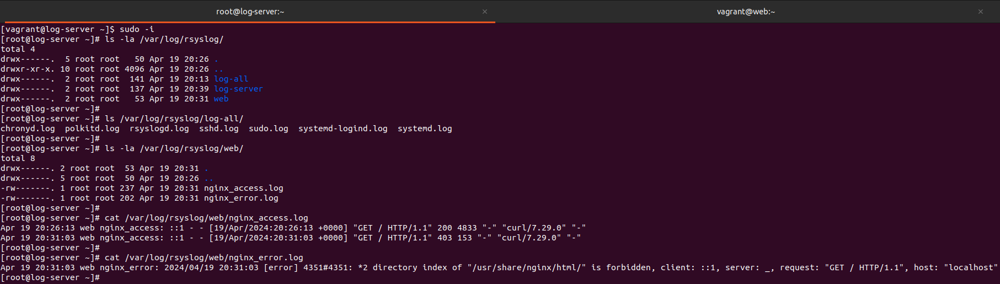

# Занятие 25. Сбор и анализ логов

## Цель домашнего задания:
Научится проектировать централизованный сбор логов. Рассмотреть особенности разных платформ для сбора логов.

## Описание домашнего задания:
1. В Vagrant разворачиваем 2 виртуальные машины web и log
2. на web настраиваем nginx
3. на log настраиваем центральный лог сервер на любой системе на выбор
 - journald
 - rsyslog
 - elk
4. настраиваем аудит, следящий за изменением конфигов nginx

Все критичные логи с web должны собираться и локально и удаленно.  
Все логи с nginx должны уходить на удаленный сервер (локально только критичные).  
Логи аудита должны также уходить на удаленную систему.  

Задание было выполнено согласно шагам из методички:  
https://docs.google.com/document/d/16UBAMu4LYqvRv6PmCeHcmOampMrIZavH/view

### Настройка центрального сервера сбора логов
См. [ansible_log_server](./ansible_log_server.yml)  

### Настройка отправки логов с web-сервера
См. [ansible_web](./ansible_web.yml)  

### Настройка отправки всех логов с 3-й виртуальной машины
См. [ansible_log_all](./ansible_log_all.yml)  

### Проверяем, что логи успешно собираются
На web-сервере перемещаем домашнюю страницу, чтобы получить ошибку:

Проверяем содержимое /var/log/rsyslog/ на центральном сервере:
