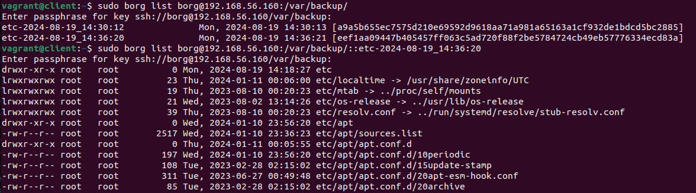

# Занятие 27. Резервное копирование

## Цель домашнего задания:
Научиться настраивать резервное копирование с помощью утилиты Borg.

## Описание домашнего задания:

Задание было выполнено согласно шагам из методички:  
https://docs.google.com/document/d/1L0VtVCn2tXmC0Pirlfhnr6rEpOANbP-C/view  

### При помощи Ansible:  
- Устанавливаем borgbackup
- На backup сервере создаем группу и пользователя borg
- Настраиваем ключи для ssh
- Инициализируем репозиторий borg на backup сервере с клиента
- Создаем сервис и таймер юниты для запуска borg backup по расписанию

### Проверяем:
