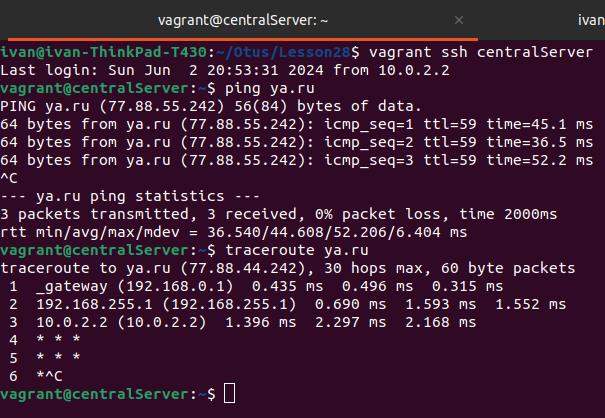

# Занятие 28. Архитектура сетей

## Цель домашнего задания:
Научиться менять базовые сетевые настройки в Linux-based системах.

## Описание домашнего задания:
Скачать и развернуть Vagrant-стенд https://github.com/erlong15/otus-linux/tree/network  
Построить следующую сетевую архитектуру:
Сеть office1  
- 192.168.2.0/26      - dev
- 192.168.2.64/26     - test servers
- 192.168.2.128/26    - managers
- 192.168.2.192/26    - office hardware

Сеть office2  
- 192.168.1.0/25      - dev
- 192.168.1.128/26    - test servers
- 192.168.1.192/26    - office hardware

Сеть central  
- 192.168.0.0/28     - directors
- 192.168.0.32/28    - office hardware
- 192.168.0.64/26    - wifi

Итого должны получиться следующие сервера:  
- inetRouter
- centralRouter
- office1Router
- office2Router
- centralServer
- office1Server
- office2Server

## Выполненные шаги

За основу взят vagrant файл из методички  
https://docs.google.com/document/d/1rQH5M2MYclBkvmv3SO4wl4F_IErcojl86hD10ric6Lk/edit

В него добавлена секция для вызова ansible provisioning.  

В ansible playbook добавлены следующие действия:  
- Настройка NAT на inetRouter
- Маршрутизация транзитных пакетов IP forward на роутерах (net.ipv4.conf.all.forwarding)
- Отключение маршрута по умолчанию на интерфейсе eth0
- Настройка статических маршрутов
- Установка traceroute на все сервера для отладки
- Перезагрузка всех серверов

Проверяем:  
  
  

