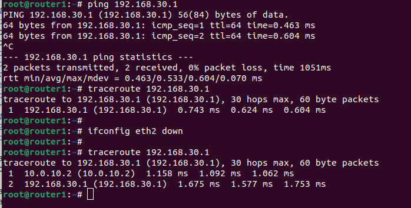
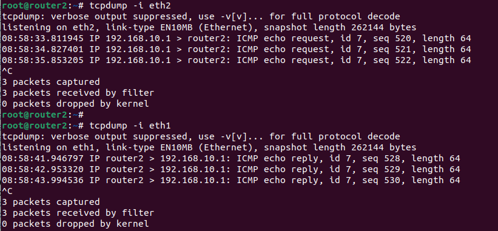
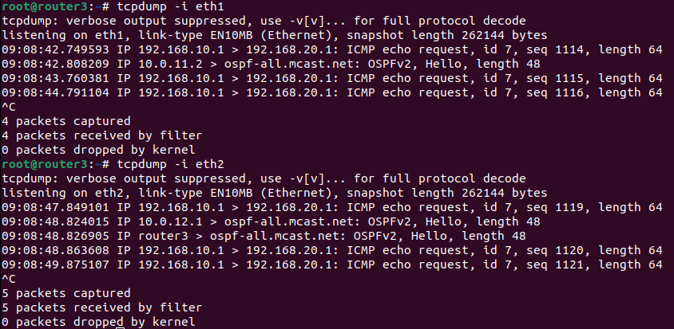

# Занятие 33. Статическая и динамическая маршрутизация, OSPF 

## Цель домашнего задания:
Создать домашнюю сетевую лабораторию. Научится настраивать протокол OSPF в Linux-based системах.

## Описание домашнего задания:

Задание было выполнено согласно шагам из методички:  
https://docs.google.com/document/d/1c3p-2PQl-73G8uKJaqmyCaw_CtRQipAt/edit

Хосты настроены при помощи Ansbile:  
- Установлены необходимые пакеты, включая FRR
- На уровне ядра разрешена маршрутизация транзитных пакетов и отключена блокировка ассиметричной маршрутизации
- Настроены конфиг-файлы FRR

Проверяем, что сеть 192.168.30.0/24 стала доступна с router1.  
Затем отключаем интерфейс eth2 и убеждаемся, что 192.168.30.0/24 остается доступной через router2:  
  

### Настройка ассиметричного роутинга
Меняем стоимость интерфейса eth1 на router в [frr.conf.router1](./frr.conf.router1)  
_!Если потребуется, можно указать «стоимость» интерфейса  
 ip ospf cost 1000_  
Выполняем vagrant provision.  

На router1 запускаем пинг от 192.168.10.1 до 192.168.20.1:  
ping -I 192.168.10.1 192.168.20.1  

На router2 запускаем tcpdump, который будет смотреть трафик на портах eth2 и eth1:
  
Видим, что eth2 только получает ICMP-трафик с адреса 192.168.10.1, а eth1 только отправляет трафик на адрес 192.168.10.1.

Также, на router3 видим, что траффик идет через него:  
 

