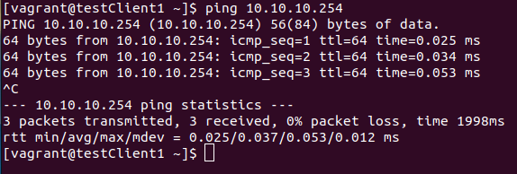
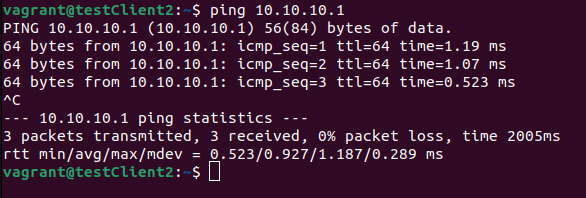
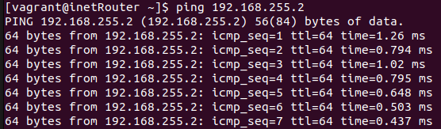
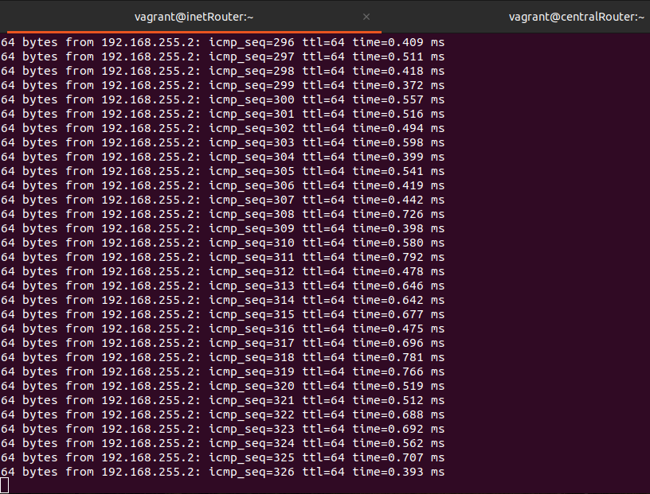

# Занятие 37. Сетевые пакеты. VLAN'ы. LACP

## Цель домашнего задания:
Научиться настраивать VLAN и LACP.

## Описание домашнего задания:

Задание было выполнено согласно шагам из методички:  
https://docs.google.com/document/d/1BO5cUT0u4ABzEOjogeHyCaNiYh76Bh73/edit  

При помощи Ansbile настроены:  
- VLAN 1 на хостах testClient1 и testServer1
- VLAN 2 на хостах testClient2 и testServer2
- LACP между хостами inetRouter и centralRouter

### Проверяем настройки VLAN:
- С хоста testClient1 проходит ping до хоста testServer1:  

- С хоста testClient2 проходит ping до хоста testServer2:  

### Проверяем работу bond-интерфейса
- На хосте inetRouter (192.168.255.1) запускаем ping до centralRouter (192.168.255.2):  

- Не отменяя ping подключаемся к хосту centralRouter и выключаем там интерфейс eth1:

- Видим, что ping не пропал, т.к. трафик пошел по-другому порту:  

