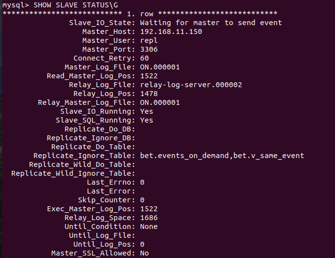
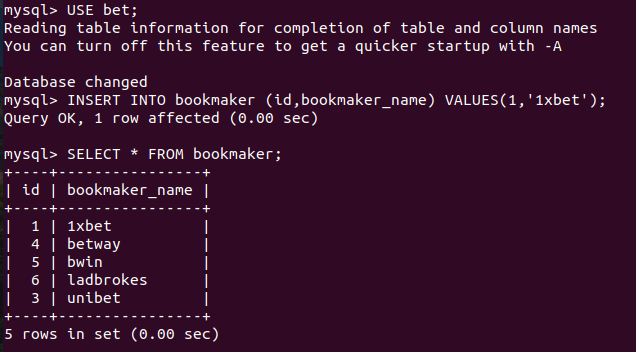
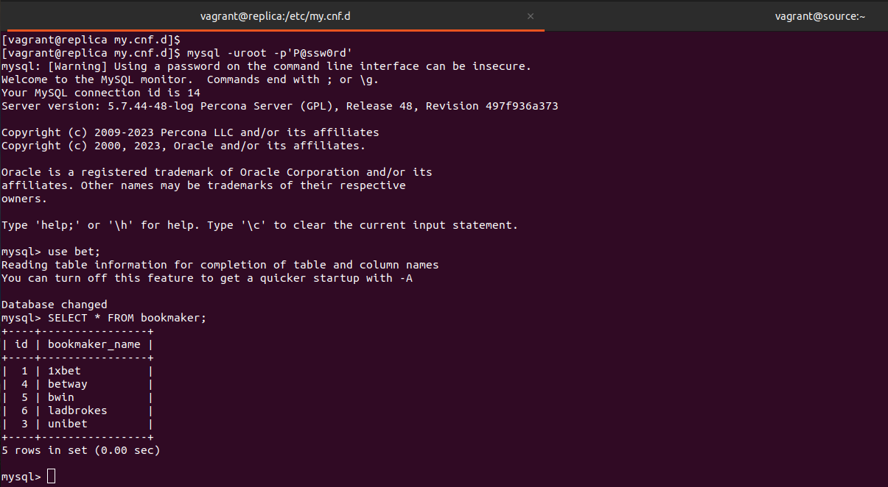

# Занятие 44. MySQL: Backup + Репликация

## Цель домашнего задания:
Научиться настраивать репликацию MySQL.

## Описание домашнего задания:

Задание было выполнено согласно шагам из методички:  
https://drive.google.com/file/d/139irfqsbAxNMjVcStUN49kN7MXAJr_z9/view

При помощи Ansbile:  
- Устанавливаем Percona Server for MySQL 5.7
- Настраиваем конфиги MySQL

### На master:
- После первого подключения изменен пароль root.
- Из бэкапа bet.dmp восстановлена база bet.
- Создан пользователь repl с правами на репликацию.
- Выгружен дамп master.sql для импорта в реплику.

### На slave:
- Загружен дамп с мастера.
- Запущен slave:  
mysql> CHANGE MASTER TO MASTER_HOST = "192.168.11.150", MASTER_PORT = 3306, MASTER_USER = "repl",  MASTER_PASSWORD = "P@ssw0rd", MASTER_AUTO_POSITION = 1;  
mysql> START SLAVE;  
mysql> SHOW SLAVE STATUS\G  

### Проверяем:
Добавляем запись в таблицу на мастере:  

Видим ее на реплике:  
