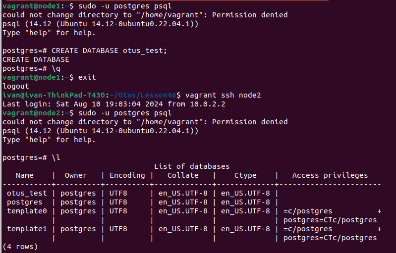
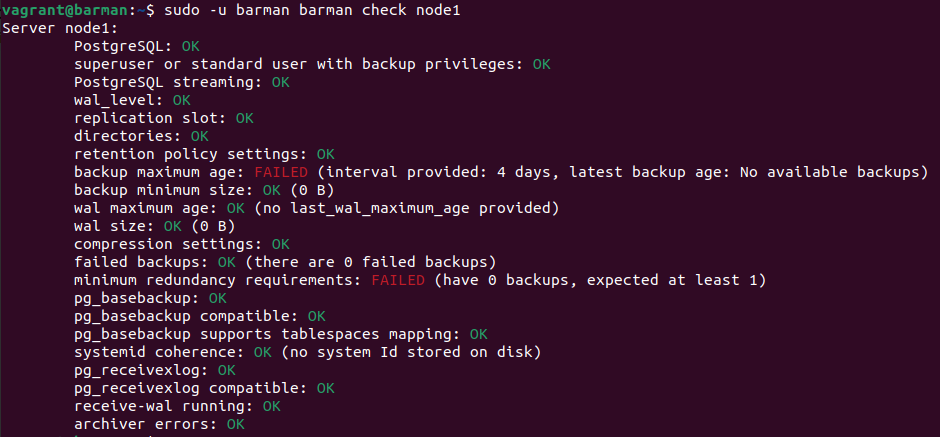
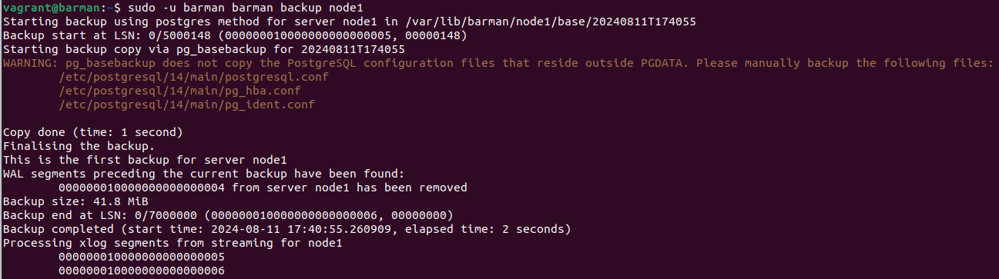
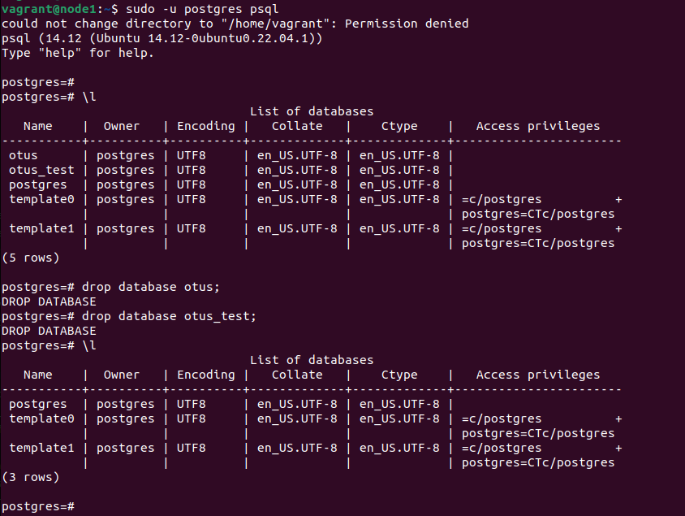
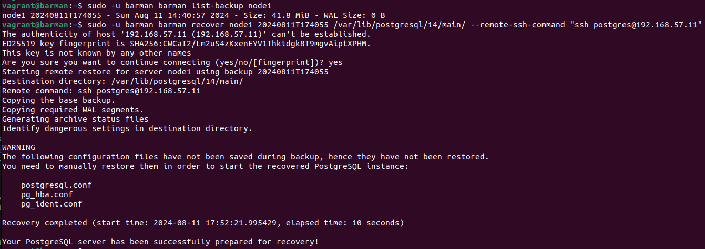
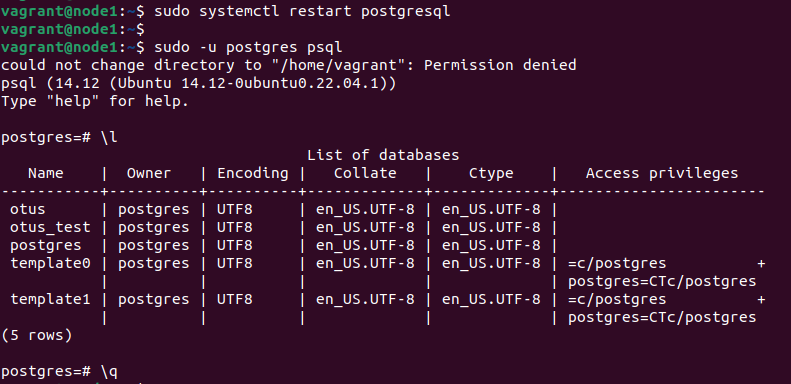

# Занятие 46. Postgres: Backup + Репликация

## Цель домашнего задания:
ННаучиться настраивать репликацию и создавать резервные копии в СУБД PostgreSQL.

## Описание домашнего задания:

1) Настроить hot_standby репликацию с использованием слотов  
2) Настроить резервное копирование  

Задание было выполнено согласно шагам из методички:  
https://docs.google.com/document/d/1EU_KF3x9e2f75sNL4sghDIxib9eMfqex/edit  

При помощи Ansbile:  
- Устанавливаем Postgres
- Настраиваем репликацию
- Устанавливаем Barman и настраиваем резервное копирование

### Проверяем репликацию:

### Проверяем резервное копирование:

Создаем бэкап:  

Удаляем базы otus и otus_test на node1:  

Восстанавливаем базу из бэкапа:  

Проверяем, что удаленная база восстановилась из бэкапа:  
