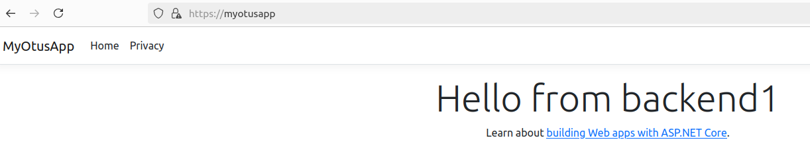

# Проектная работа: Развертывание web-приложения ASP.NET Core на серверах Linux с использованием подхода IaC (Инфраструктура как код).

## Описание проектной работы:

При помощи Vagrant и Ansible развернут тестовый стэнд, включающий в себя следующие хосты:
- Фронтенд (nginx c настроенным https)
- 2 бэкенда (с развернутыми на них ASP.NET Core web-приложением)
- 2 ноды PostgreSQL с репликацией
- Barman для бэкапов базы данных
- Сервер сбора логов
- Prometheus для мониторинга и алертинга

https://myotusapp/  

Prometheus:  
http://192.168.57.10:9090/targets?search=

